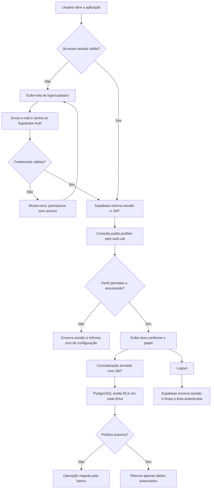

# Relatório técnico — Encontro 02: Supabase Auth + RLS

## 1. Identificação

**Projeto:** Sistema Web de Gestão de Cursos  
**Encontro:** 02 — identidade, sessões e segurança no banco  
**Aluno/grupo:** preencher  
**Data de conclusão prevista:** 2 de outubro de 2026  
**Status da implementação:** código e migração preparados; execução na instância Supabase e testes com contas reais ainda precisam ser confirmados pelo responsável.

## 2. Objetivo e pesquisa orientada

- **Autenticação (Auth):** processo de verificar quem é a pessoa, por exemplo por e-mail e senha. O Supabase Auth valida as credenciais e retorna a identidade autenticada.
- **Autorização:** decisão sobre o que uma identidade já autenticada pode fazer. Neste projeto, o papel (`administrador`, `professor` ou `aluno`) e as regras do banco determinam essas ações.
- **JWT:** JSON Web Token assinado que transporta declarações da identidade e da sessão. O cliente o envia nas chamadas autenticadas; o banco usa as declarações verificadas (como `auth.uid()`) para aplicar políticas. Não é uma senha nem deve ser editado pelo cliente.
- **Sessão:** estado de autenticação mantido pelo SDK, que inclui tokens e identidade, é persistido/renovado conforme configuração e termina no logout ou expiração. O frontend restaura a sessão com `getSession()` e encerra com `signOut()`.
- **Row Level Security (RLS):** mecanismo do PostgreSQL/Supabase que avalia políticas por linha em cada consulta. Sem política aplicável, o acesso é negado; esconder controles no navegador não substitui RLS.
- **Por que esconder botão não é segurança?** O usuário pode chamar a API diretamente, alterar o JavaScript ou enviar uma requisição própria. Por isso as operações são restringidas no banco, independentemente da interface.

## 3. Fluxograma do login

## 4. Implementação

1. **Authentication:** `src/index.html` oferece formulários de login e cadastro. `src/app.js` usa `supabase.auth.signUp`, `signInWithPassword`, `getSession`, `onAuthStateChange` e `signOut`. O cadastro envia nome em metadata; a chave `role` não é aceita do navegador.
2. **Perfis:** `sql/02_auth_rls.sql` cria `public.profiles`, chave primária ligada a `auth.users(id)`, papel restrito por `CHECK` e trigger que cria automaticamente perfil como `aluno`.
3. **Cursos:** adiciona `professor_id` em `cursos`; professor cria/edita apenas cursos vinculados à própria identidade; aluno lê cursos ativos; administrador lê e administra todos.
4. **Matrículas:** cria `matriculas_auth`, vinculada ao perfil autenticado e curso. Aluno consulta/cria as próprias matrículas; professor consulta matrículas dos próprios cursos; admin administra todas.
5. **Compatibilidade:** a tabela antiga `alunos` e `matriculas` é preservada para dados do Encontro 01, mas deixa de ser acessível pelo cliente autenticado/anônimo depois da migração. Nenhuma política nela equivale a negar acesso via API.
6. **Administração de papéis:** promoção inicial deve ser feita por operador privilegiado no SQL Editor após criar e confirmar a conta. O script não abre signup de administrador. A interface de admin pode alterar papel de outros usuários, mas RLS bloqueia autoalteração de papel.

## 5. Matriz de permissões

| Recurso / ação | Administrador | Professor | Aluno | Anônimo |
|---|---|---|---|---|
| Perfis | Lê todos; altera perfis de terceiros | Lê o próprio perfil | Lê o próprio perfil | Nenhum |
| Cursos — listar | Todos | Cursos vinculados a si | Somente ativos | Nenhum |
| Cursos — criar | Sim; pode atribuir professor | Sim; fica vinculado ao próprio usuário | Não | Não |
| Cursos — editar | Todos | Apenas os próprios | Não | Não |
| Cursos — excluir | Sim via política RLS (sem botão na UI) | Não | Não | Não |
| Matrículas autenticadas — ler | Todas | Matrículas nos próprios cursos | Próprias | Nenhuma |
| Matrículas — criar | Sim via política admin | Não | Próprias, em cursos ativos | Não |
| Matrículas — atualizar | Todas | Não | Próprias | Não |
| Tabela legada `alunos`/`matriculas` | Sem acesso web após migração | Sem acesso | Sem acesso | Sem acesso |

> RLS e permissões SQL complementam a interface: os controles de frontend não são a barreira de segurança.

## 6. Políticas RLS documentadas

Arquivo de implantação: `sql/02_auth_rls.sql`.

- `profiles_select_self_or_admin`: usuário consulta o próprio perfil; admin consulta todos.
- `profiles_update_self`: usuário atualiza perfil próprio sem mudar seu `role`.
- `profiles_admin_manage_others`: admin gere perfis de terceiros, sem usar essa policy para autoelevação.
- `courses_read_by_role`: admin vê todos, professor vê os seus, aluno vê apenas `ativo = true`.
- `courses_teacher_insert_own`: professor só insere curso com `professor_id = auth.uid()`; admin pode inserir.
- `courses_teacher_update_own`: professor só atualiza curso próprio e não pode reassociá-lo a outra pessoa.
- `courses_admin_update` e `courses_admin_delete`: administração global de cursos.
- `enrollments_read_own_teacher_admin`: aluno vê a própria matrícula, professor as de seus cursos e admin todas.
- `enrollments_student_insert_own`: aluno só cria matrícula para si em curso ativo.
- `enrollments_student_cancel_own`: aluno só atualiza a própria matrícula.
- `enrollments_admin_manage`: admin administra matrículas.
- `alunos` e `matriculas` legadas: políticas permissivas removidas, grants retirados e sem policy, portanto negadas via API.

A função `public.current_user_role()` é `SECURITY DEFINER`, com `search_path` vazio, para consultar o papel sem recursão de RLS. Ela não é exposta a `anon`; o trigger `handle_new_user()` força o papel `aluno`.

## 7. Execução e configuração necessárias

1. No Supabase, abra **SQL Editor** e execute primeiro (se ainda não executado) `sql/01_schema_e_dados.sql`; em seguida execute `sql/02_auth_rls.sql`.
2. Em **Authentication > Providers**, habilite Email. Configure confirmação de e-mail de acordo com o exercício e configure URLs locais permitidas (`http://localhost:5500/**`) em **URL Configuration**.
3. Confirme que `src/config.js` contém a URL correta e somente chave pública `publishable`/`anon`. Nunca coloque `service_role` no navegador.
4. Promova uma conta administrativa no SQL Editor, conforme bloco comentado ao final do SQL. Faça essa ação só após confirmar o e-mail correto.
5. Atribua perfil `professor` e `professor_id` a contas de teste pelo SQL Editor; crie contas alunas pelo formulário.
6. Na pasta raiz do projeto, sirva por HTTP: `python3 -m http.server 5500 --directory .` e abra `http://localhost:5500/src/`. O relatório está em `http://localhost:5500/docs/relatorio_encontro_02.md`.
7. Recarregue depois de aplicar migrações e teste com contas diferentes, preferencialmente em janelas/perfis de navegador separados.

## 8. Tabela de testes — usuário × ação × resultado

**Estado honesto dos testes:** a verificação de integração real requer executar a migração no projeto Supabase e usar contas válidas; isso não foi executado por esta implementação. Os resultados abaixo são **esperados, pendentes de validação na instância**; não representam testes ao vivo já aprovados.

| Usuário | Ação | Resultado esperado | Resultado obtido |
|---|---|---|---|
| Anônimo | Abrir a página | Apenas login/cadastro | Pendente de teste ao vivo |
| Aluno | Login com e-mail/senha válidos | Sessão criada; papel aluno exibido | Pendente de teste ao vivo |
| Aluno | Listar cursos | Apenas cursos ativos | Pendente de teste ao vivo |
| Aluno | Matricular-se em curso ativo | Matrícula própria criada | Pendente de teste ao vivo |
| Aluno A | Consultar matrícula do aluno B por API | Negado/nenhuma linha retornada | Pendente de teste ao vivo |
| Aluno | Tentar criar matrícula para outro `aluno_id` | Bloqueado pela policy RLS | Pendente de teste ao vivo |
| Aluno | Tentar editar/criar curso | Bloqueado pelo banco | Pendente de teste ao vivo |
| Professor A | Criar curso com seu `auth.uid()` | Permitido; curso associado a A | Pendente de teste ao vivo |
| Professor A | Editar curso do Professor B | Bloqueado/nenhuma linha alterada | Pendente de teste ao vivo |
| Professor | Consultar matrículas de curso próprio | Permitido | Pendente de teste ao vivo |
| Administrador | Listar perfis/cursos | Registros globais visíveis | Pendente de teste ao vivo |
| Administrador | Alterar papel de outro usuário | Permitido | Pendente de teste ao vivo |
| Administrador | Alterar seu próprio papel via UI/API | Bloqueado pelas policies descritas | Pendente de teste ao vivo |
| Anônimo | Consultar tabelas legadas pela API | Negado após migração | Pendente de teste ao vivo |
| Usuário | Logout e tentar consultar a área protegida | Sessão encerrada; volta ao login | Pendente de teste ao vivo |

### Procedimento rápido para provar isolamento

1. Crie duas contas de aluno e uma conta de professor.
2. Como operador privilegiado, altere um perfil para professor e vincule um curso a esse `id`.
3. Autentique uma sessão por vez. Tente ler/alterar curso alheio e matrícula de outra conta via interface e API.
4. Confirme o status HTTP/erro do PostgREST e a ausência de linhas, não apenas o botão escondido.
5. Registre os resultados reais, data e capturas de tela nesta tabela antes da entrega acadêmica.

## 9. Fontes consultadas

- [Supabase Auth — Password-based authentication](https://supabase.com/docs/guides/auth/passwords)
- [Supabase Auth — User management](https://supabase.com/docs/guides/auth/managing-user-data)
- [Supabase — Row Level Security](https://supabase.com/docs/guides/database/postgres/row-level-security)
- [Supabase JavaScript — signInWithPassword](https://supabase.com/docs/reference/javascript/auth-signinwithpassword)
- [PostgreSQL — CREATE POLICY](https://www.postgresql.org/docs/current/sql-createpolicy.html)
